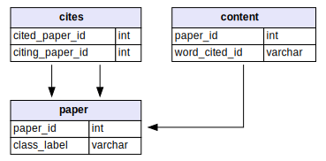
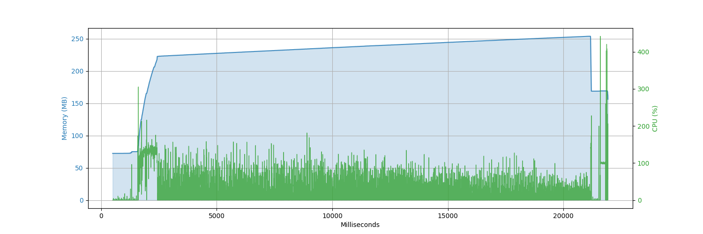

## Constructing Cora Dataset from MariaDB

Official Website: https://relational.fit.cvut.cz/dataset/CORA

Script connects to public database with given credentials and retrieves/gathers regarding data from different tables
into CSV files.

- Database connection `pool_size` and `max_overflow` is set to give a custom behavior to `sqlachemy.pool.QueuePool`
  which is a connection pool.
- There is an extra thread-pool in the script itself to retrieve and process each unique paper with single
  SQL query. That means all transactions are distributed among underlying CPUs.

Here is the memory and CPU usages:

Host Machine Specs:

- CPU: Apple M1 (8 Core)
- Memory: 16384MiB
